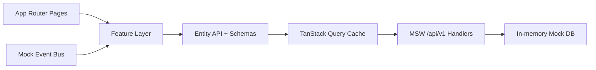

# AccessOps Dashboard


Production-grade admin dashboard built with Next.js, React, and TypeScript. The project simulates a real enterprise access-management system: authentication, RBAC, complex CRUD flows, permission matrix editing, audit visibility, real-time updates, and resilience UX.

This is a frontend-first portfolio case. REST endpoints and real-time events are mocked with MSW and an in-browser event bus, so the product behaves like a full system without requiring a backend service.

## Project Scope

This project models an access-management dashboard with the workflows typically found in internal enterprise systems.

It focuses on:

- authenticated access with role-aware routing
- operational data tables with filtering, sorting, pagination, and URL state
- form-heavy CRUD flows with validation and optimistic updates
- permission management through a matrix-based policy editor
- audit visibility with searchable event history
- resilience patterns such as retry handling, offline feedback, and error boundaries

The application is frontend-first: backend behavior is simulated with MSW and in-memory mock data so the full flow can be demonstrated locally.

## Implemented Areas

- Authentication, session handling, and protected routes
- RBAC behavior for `Admin`, `Manager`, and `Viewer`
- Users module with search, filters, sorting, pagination, date range, and bulk actions
- User details and edit flow with dynamic validation and async checks
- Roles permission matrix with diff tracking and JSON import/export
- Audit log with infinite loading, filters, expandable payload details, and CSV export
- Real-time event simulation with cache invalidation
- Offline banner, connectivity notifications, and dashboard error boundary
- Unit tests, Playwright e2e coverage, CI pipeline, and bundle budget checks

## Screenshots

### Login

Clean entry point with demo accounts and protected-route redirect flow.


### Users Dashboard

Main operational screen: search, filters, sorting, pagination, date range, row selection, and bulk actions.


### User Edit Form

Form-heavy workflow with dynamic validation, async email uniqueness checks, and unsaved-changes protection.


### Roles Matrix

The strongest showcase screen: permission matrix editing, change diffing, import/export, and effective permission summary.


### Roles Read-Only State

Demonstrates RBAC depth: `Manager` can inspect the policy but cannot modify or save it.


### Audit Log

Infinite event feed with filters, expandable JSON details, and CSV export.


## Feature Set

### Authentication and RBAC

- Mock login with three demo roles: `Admin`, `Manager`, `Viewer`
- Route protection through middleware and client-side guards
- Role-aware UI behavior:
  - `Admin` can edit and save policies
  - `Manager` has explicit read-only access on protected workflows
  - `Viewer` is blocked from restricted routes
- Fast role switching for demo and QA scenarios

### Users Module

- Server-like users table powered by TanStack Query
- Search, filters, sorting, pagination, and created-at range filtering
- URL-synced table state for shareable/reload-safe views
- Row selection with bulk suspend / bulk activate actions
- User details page
- Edit flow with React Hook Form + Zod
- Dynamic validation (for example, suspension reason becomes required when user is suspended)
- Async email uniqueness check
- Optimistic cache updates with rollback on failure

### Roles and Permissions

- Permission matrix with cell, row, column, and global toggles
- Draft vs saved state diff tracking
- JSON import / export for policy workflows
- Effective permission summary for the selected role
- Locked UX for read-only roles

### Audit and Visibility

- Infinite audit feed with `useInfiniteQuery`
- Filters by user, action, and date range
- Expandable JSON event payload details
- Export loaded events to CSV

### Real-Time and Resilience UX

- Mock WebSocket-like event stream with manual trigger and auto events in dev
- Query cache invalidation on relevant domain updates
- Connectivity toasts and offline banner
- Route-level dashboard error boundary
- Retry policy for transient query failures

## Tech Stack

- Next.js 16 (App Router)
- React 19
- TypeScript (strict)
- Tailwind CSS + shadcn/ui primitives
- TanStack Query
- React Hook Form + Zod
- MSW for REST mocking
- Custom in-browser event bus for real-time simulation
- Vitest + Testing Library
- Playwright E2E
- ESLint + Prettier + Husky + lint-staged
- GitHub Actions CI

## Architecture

```text
src/
  app/                  # app router routes, layouts, route wrappers
  entities/             # domain schemas, entity API contracts
    user/
    role/
    audit/
  features/             # business features built on entities
    auth/
    users/
    roles/
    audit/
    realtime/
    connectivity/
    observability/
  widgets/              # dashboard shell and composed UI blocks
  shared/               # api client, hooks, utilities, common types
  mocks/                # fixtures, handlers, in-memory db, ws event bus
tests/
  e2e/
```

### Frontend Flow



## Local Setup

```bash
pnpm install
pnpm dev
```

Open `http://localhost:3000`

### Demo Accounts

- `admin@accessops.dev / demo123`
- `manager@accessops.dev / demo123`
- `viewer@accessops.dev / demo123`

## Quality Gates

```bash
pnpm lint
pnpm typecheck
pnpm test
pnpm e2e
pnpm build
pnpm check:bundle
```

What is covered:

- unit tests for business logic and query-state serialization
- e2e tests for auth, users flows, RBAC negative cases, and roles import/save flows
- production build validation
- bundle-size budget check in CI

## Mocking Model

- All REST endpoints are versioned under `/api/v1/*`
- MSW simulates backend behavior for users, roles, audit, and validation endpoints
- Mock data is deterministic and stored in in-memory fixtures
- Real-time updates are simulated client-side through an event bus
- The dashboard header includes a `Simulate event` action for demoing live updates on demand

This keeps the project fully portable while still demonstrating realistic frontend architecture and state behavior.

## 5-Minute Recruiter Demo

1. Sign in as `admin@accessops.dev`.
2. Open `Users` and apply search, filters, sorting, and date range.
3. Select multiple rows and run a bulk status action.
4. Open a user edit page, trigger validation, save changes, and observe the optimistic UX.
5. Open `Roles`, change matrix values, inspect the diff, import JSON, and save.
6. Switch to `Manager` and show the read-only locked state.
7. Open `Audit`, expand event details, and export CSV.
8. Trigger `Simulate event` and show the refresh/toast behavior.

## CI and Developer Workflow

GitHub Actions pipeline runs:

- lint
- typecheck
- unit tests
- Next.js production build
- bundle budget check
- Playwright e2e suite

Local developer workflow also includes:

- `husky` pre-commit hook
- `lint-staged` for staged file quality checks
- conventional commit-friendly release notes via [`CHANGELOG.md`](./CHANGELOG.md)

## Production-Readiness Notes

Detailed supporting docs:

- [Authorization Model](./docs/AUTHORIZATION_MODEL.md)
- [Observability](./docs/OBSERVABILITY.md)
- [Performance Budget](./docs/PERFORMANCE_BUDGET.md)
- [Security Notes](./docs/SECURITY_NOTES.md)
- [Release Process](./docs/RELEASE_PROCESS.md)
