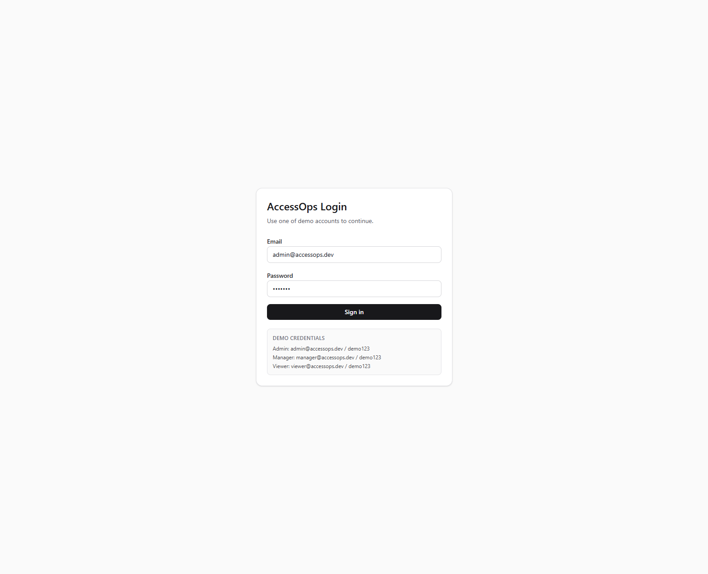
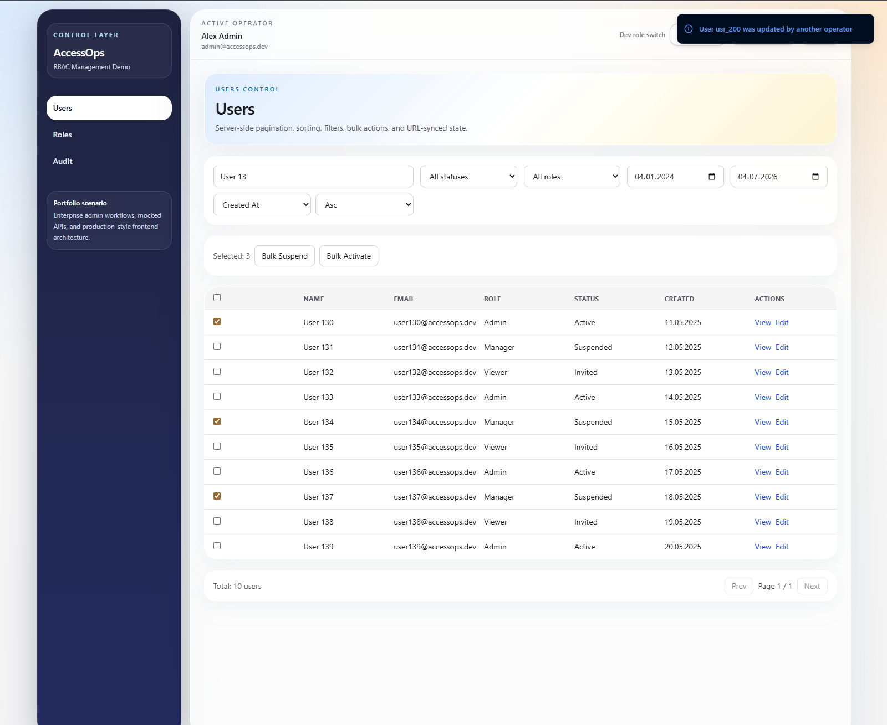
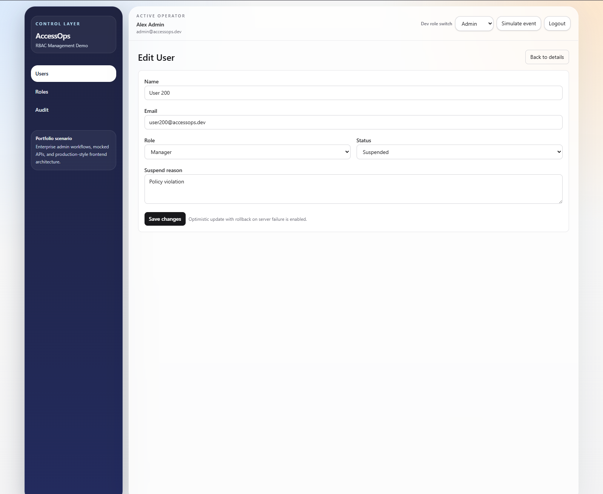
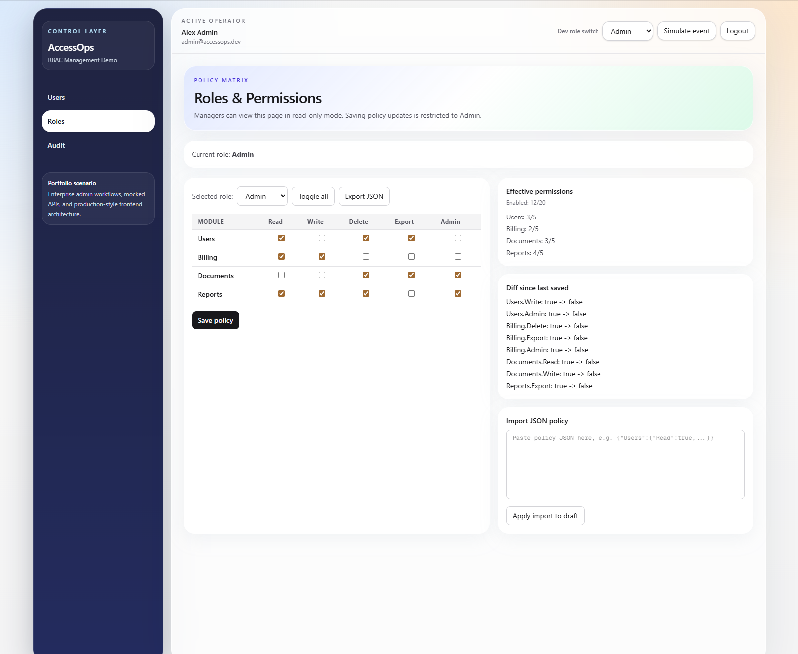
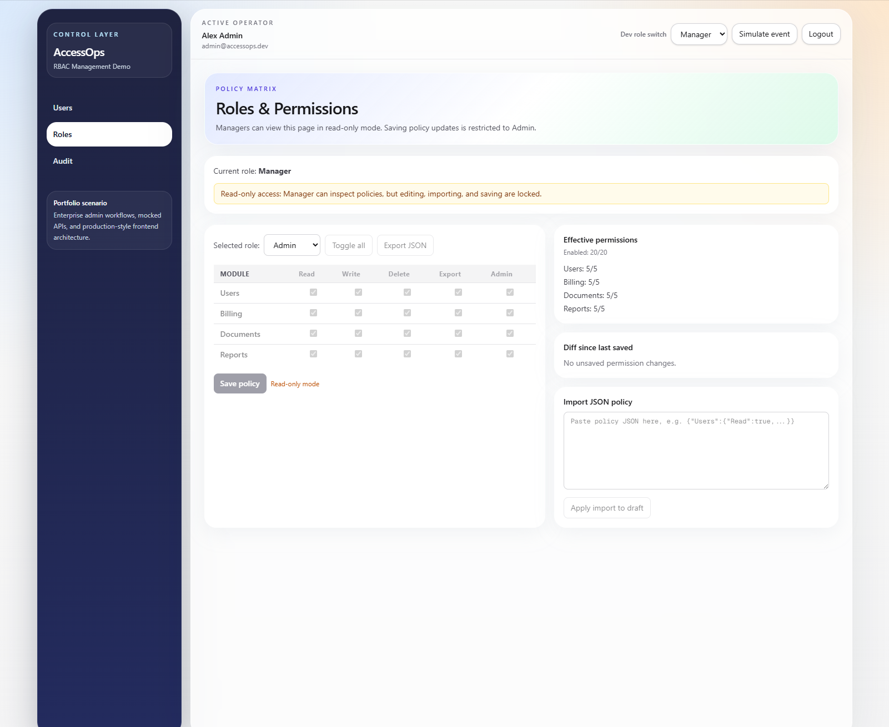
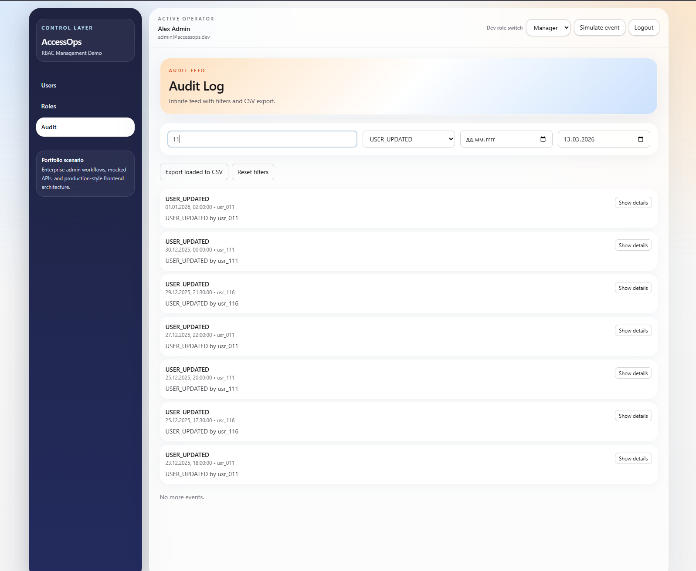
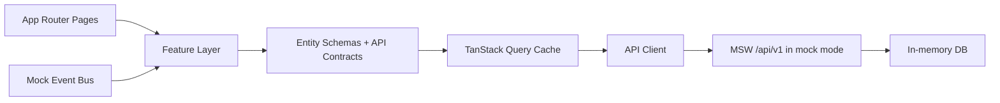

# AccessOps Dashboard


Enterprise-style admin dashboard focused on **access management workflows**: auth, RBAC, policy revisions, auditability, resilience UX, and engineering quality gates.

## Quick Start

```bash
pnpm install
pnpm dev
```

Open `http://localhost:3000` and sign in with:

- `admin@accessops.dev / demo123`

## Table of Contents

- [Why This Repo Is Strong](#why-this-repo-is-strong)
- [Screenshots](#screenshots)
- [What Problem It Solves](#what-problem-it-solves)
- [Feature Highlights](#feature-highlights)
  - [Authentication and RBAC](#authentication-and-rbac)
  - [Users Operations](#users-operations)
  - [Roles and Policy Revisions](#roles-and-policy-revisions)
  - [Audit and Visibility](#audit-and-visibility)
  - [Resilience and Observability](#resilience-and-observability)
- [Runtime Modes (Mock and API)](#runtime-modes-mock-and-api)
- [UI State Catalog (Storybook-equivalent)](#ui-state-catalog-storybook-equivalent)
- [Architecture](#architecture)
- [Testing Strategy](#testing-strategy)
- [Local Setup](#local-setup)
- [Quality Gates](#quality-gates)
- [CI Pipeline](#ci-pipeline)
- [Trade-offs](#trade-offs)
- [Documentation Index](#documentation-index)
- [5-Minute Demo Script](#5-minute-demo-script)
- [Future Improvements](#future-improvements)

## Why This Repo Is Strong

This project is not a “pretty dashboard shell”. It demonstrates:

- **Product realism**: real admin flows, not isolated UI widgets
- **Domain depth**: authorization model + policy revision lifecycle
- **Reliability mindset**: retries, offline handling, typed API contracts, diagnostics
- **Delivery discipline**: unit/e2e/a11y smoke tests, CI gates, bundle budgets

## Screenshots

### Login



### Users Dashboard



### User Edit Form



### Roles Matrix



### Roles Read-only State



### Audit Log



## What Problem It Solves

Internal systems that manage access rights must handle:

- strict route and action permissions
- high-volume operational tables
- safe policy changes with revision control
- clear audit trails
- diagnostics for failures in real usage

AccessOps models exactly these workflows in a frontend-first architecture.

## Feature Highlights

### Authentication and RBAC

- Demo auth for `Admin`, `Manager`, `Viewer`
- Protected routes via middleware + client guards
- Role-aware behavior:
  - `Admin`: full policy actions
  - `Manager`: read-only policy access
  - `Viewer`: blocked from protected management flows

### Users Operations

- Query-driven table with URL-synced state
- Search, role/status/date filters, sorting, pagination
- Bulk suspend/activate
- User details and edit flow
- Schema validation + async email uniqueness check
- Optimistic update UX with rollback support

### Roles and Policy Revisions

- Permission matrix (cell/row/column/global toggles)
- JSON import/export
- Draft vs active diff
- Revision lifecycle:
  - propose revision
  - approve or reject proposed revision
  - rollback to historical revision
- Revision history with statuses and metadata

### Audit and Visibility

- Infinite audit feed (`useInfiniteQuery`)
- User/action/date filters
- Expandable JSON details
- CSV export of loaded events

### Resilience and Observability

- Retry policy and network-aware UX
- Connectivity toasts + offline banner
- Web Vitals and performance budget warnings
- Categorized telemetry (`auth`, `permission`, `validation`, `network`, `backend`, `performance`)
- Correlation IDs on API requests (`x-correlation-id`)
- Development diagnostics panel with live event stream and filters

## Runtime Modes (Mock and API)

Two runtime API modes:

- `mock` (default): MSW + in-memory fixtures
- `api`: calls real API origin with same frontend contracts

`.env.local` example:

```bash
NEXT_PUBLIC_API_MODE=mock
# NEXT_PUBLIC_API_BASE_URL=http://localhost:4000
```

## UI State Catalog (Storybook-equivalent)

Visual state catalog is available at:

- `/roles?view=states`

It documents canonical admin states: empty/loading/error/read-only/offline/revision/destructive confirmation and is covered by Playwright smoke checks.

## Architecture

```text
src/
  app/                  # routes, layouts, providers
  entities/             # domain schemas + API contracts
    user/
    role/
    audit/
  features/             # business capabilities
    auth/
    users/
    roles/
    audit/
    realtime/
    connectivity/
    observability/
  widgets/              # composed page-level UI
  shared/               # api client, hooks, utilities, config
  mocks/                # handlers, fixtures, in-memory db, ws bus
tests/
  e2e/
```



## Testing Strategy

| Layer                               | Goal                   | Examples                                                    |
| ----------------------------------- | ---------------------- | ----------------------------------------------------------- |
| Unit (Vitest)                       | Domain correctness     | RBAC, matrix utils, query param serialization, retry policy |
| Integration-like (mock db/handlers) | Workflow invariants    | policy revision propose/approve/reject/rollback             |
| E2E (Playwright)                    | User-visible behavior  | auth/users/roles/audit/diagnostics/ui-state flows           |
| A11y smoke (Playwright)             | Accessibility baseline | landmarks, labels, keyboard flow, expanded states           |

## Local Setup

```bash
pnpm install
pnpm dev
```

Open `http://localhost:3000`.

Demo users:

- `admin@accessops.dev / demo123`
- `manager@accessops.dev / demo123`
- `viewer@accessops.dev / demo123`

## Quality Gates

```bash
pnpm lint
pnpm typecheck
pnpm test
pnpm e2e:a11y
pnpm e2e
pnpm build
pnpm check:bundle
```

Bundle budgets:

- total JS chunks: `<= 1500 KB`
- largest chunk: `<= 350 KB`

## CI Pipeline

GitHub Actions runs:

- lint
- typecheck
- unit tests
- production build
- bundle budget check
- a11y smoke checks
- full Playwright e2e suite

## Trade-offs

- No bundled real backend implementation yet; `api` mode is integration-ready.
- Table virtualization is deferred for current demo-scale data volume.
- Diagnostics panel is intentionally dev-only.
- Auth/session in mock mode is demo-oriented; production needs server authority.

## Documentation Index

- [Authorization Model](./docs/AUTHORIZATION_MODEL.md)
- [Accessibility](./docs/ACCESSIBILITY.md)
- [UI State Catalog](./docs/UI_STATE_CATALOG.md)
- [Observability](./docs/OBSERVABILITY.md)
- [Performance Budget](./docs/PERFORMANCE_BUDGET.md)
- [Security Notes](./docs/SECURITY_NOTES.md)
- [Release Process](./docs/RELEASE_PROCESS.md)

## 5-Minute Demo Script

1. Sign in as `admin@accessops.dev`.
2. Open `Users`; apply filters/sorting/pagination and execute bulk action.
3. Edit a user and show optimistic update behavior.
4. Open `Roles`; change draft policy, propose revision, approve revision.
5. Show revision history and rollback.
6. Switch to `Manager` and demonstrate read-only lock.
7. Open `Audit`; filter, expand details, export CSV.
8. Open diagnostics panel and show telemetry categories + network/runtime info.

## Future Improvements

- Add backend reference implementation (SQLite/PostgreSQL) for full `api` mode demo.
- Add policy templates and import preview/dry-run validation.
- Add visual regression snapshots for critical admin screens.
- Add historical performance snapshots in CI.
