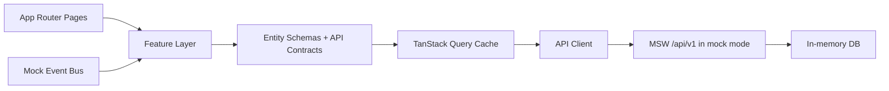

# AccessOps Dashboard


Production-grade admin dashboard that models real access-management workflows: authentication, RBAC, policy revisions, auditability, operational tables, resilience, and observability.

## Table of Contents

- [Why This Project Exists](#why-this-project-exists)
- [Scope](#scope)
- [Runtime Modes](#runtime-modes)
- [Core Workflows](#core-workflows)
  - [Authentication and RBAC](#authentication-and-rbac)
  - [Users Operations](#users-operations)
  - [Roles and Policy Revisions](#roles-and-policy-revisions)
  - [Audit and Visibility](#audit-and-visibility)
  - [Resilience and Observability](#resilience-and-observability)
- [UI State Coverage](#ui-state-coverage)
- [Architecture](#architecture)
- [Test Strategy](#test-strategy)
- [Local Setup](#local-setup)
- [Quality Gates](#quality-gates)
- [CI Pipeline](#ci-pipeline)
- [Product and Engineering Trade-offs](#product-and-engineering-trade-offs)
- [Documentation Index](#documentation-index)
- [5-Minute Demo Script](#5-minute-demo-script)
- [Future Improvements](#future-improvements)

## Why This Project Exists

Most dashboard demos prove component styling.  
This project is built to prove product and engineering depth in enterprise admin scenarios:

- authorization domain modeling, not only route guards
- workflow realism (policy revision lifecycle, rollback, audit trail)
- robustness under operational edge cases (offline, retries, invalid payloads, partial failures)
- quality discipline (unit + e2e + a11y smoke + CI + bundle budget)

## Scope

AccessOps simulates an internal access-management platform with:

- protected access and role-aware behavior
- users operations with filters, sorting, pagination, bulk actions
- form-heavy edit flows with validation and optimistic updates
- role policy editing through a permission matrix
- policy revision workflow: propose, approve/reject, rollback
- searchable audit feed with export
- diagnostics-first frontend observability

## Runtime Modes

The app supports two runtime API modes:

- `mock` (default): MSW + in-memory fixtures
- `api`: calls real API origin while preserving the same frontend contracts

Configure via `.env.local`:

```bash
# default is mock
NEXT_PUBLIC_API_MODE=mock

# used only when NEXT_PUBLIC_API_MODE=api
# NEXT_PUBLIC_API_BASE_URL=http://localhost:4000
```

## Core Workflows

### Authentication and RBAC

- demo login for `Admin`, `Manager`, `Viewer`
- middleware + client-side route access logic
- role-aware behavior:
  - `Admin`: full policy actions
  - `Manager`: read-only policy access
  - `Viewer`: restricted from protected management routes

### Users Operations

- query-driven users table with URL-synced state
- search, role/status/date filters, sorting, pagination
- bulk suspend/activate
- user details and edit flow
- schema validation + async uniqueness checks
- optimistic updates + rollback on failure

### Roles and Policy Revisions

- permission matrix (cell/row/column/global toggles)
- policy JSON import/export
- diff between active and draft policy
- revision lifecycle:
  - propose revision
  - approve/reject proposed revision
  - rollback to historical revision
- revision history with status and metadata

### Audit and Visibility

- infinite audit feed (`useInfiniteQuery`)
- filters by user/action/date range
- expandable event details
- CSV export of currently loaded events

### Resilience and Observability

- offline/online feedback and retry policy
- web vitals logging + performance budget warnings
- categorized telemetry:
  - `auth`, `permission`, `validation`, `network`, `backend`, `performance`
- request correlation IDs (`x-correlation-id`)
- dev diagnostics panel:
  - live diagnostics stream
  - category filter
  - active runtime mode and network state

## UI State Coverage

Storybook-equivalent visual state catalog:

- `/roles?view=states`

Covered states include empty/loading/error/read-only/offline/revision/destructive confirmation.

## Architecture

```text
src/
  app/                  # routes, layouts, providers
  entities/             # domain schemas + API contracts
    user/
    role/
    audit/
  features/             # business capabilities
    auth/
    users/
    roles/
    audit/
    realtime/
    connectivity/
    observability/
  widgets/              # composed page-level UI
  shared/               # api client, hooks, utilities, config
  mocks/                # handlers, fixtures, in-memory db, ws bus
tests/
  e2e/
```



## Test Strategy

| Layer                               | Focus                          | Examples                                                           |
| ----------------------------------- | ------------------------------ | ------------------------------------------------------------------ |
| Unit (Vitest)                       | Domain correctness             | RBAC rules, policy matrix utils, query param mapping, retry policy |
| Integration-like (mock db/handlers) | Workflow logic in mock backend | role revision propose/approve/reject/rollback                      |
| E2E (Playwright)                    | User-visible behavior          | auth/users/roles/audit flows, diagnostics panel, UI states         |
| A11y smoke (Playwright)             | Keyboard + semantics baseline  | landmarks, labels, expanded states, table naming                   |

## Local Setup

```bash
pnpm install
pnpm dev
```

Open `http://localhost:3000`.

Demo accounts:

- `admin@accessops.dev / demo123`
- `manager@accessops.dev / demo123`
- `viewer@accessops.dev / demo123`

## Quality Gates

```bash
pnpm lint
pnpm typecheck
pnpm test
pnpm e2e:a11y
pnpm e2e
pnpm build
pnpm check:bundle
```

Bundle budgets:

- total JS chunks: `<= 1500 KB`
- largest JS chunk: `<= 350 KB`

## CI Pipeline

GitHub Actions runs:

- lint
- typecheck
- unit tests
- production build
- bundle budget check
- a11y smoke e2e
- full e2e suite

## Product and Engineering Trade-offs

- No real backend included in this repository by default; `api` mode is ready for integration.
- Table virtualization is intentionally postponed for current data scale.
- Diagnostics panel is development-only by design.
- Auth/session is demo-oriented in mock mode; production requires server authority and secure session handling.

## Documentation Index

- [Authorization Model](./docs/AUTHORIZATION_MODEL.md)
- [Accessibility](./docs/ACCESSIBILITY.md)
- [UI State Catalog](./docs/UI_STATE_CATALOG.md)
- [Observability](./docs/OBSERVABILITY.md)
- [Performance Budget](./docs/PERFORMANCE_BUDGET.md)
- [Security Notes](./docs/SECURITY_NOTES.md)
- [Release Process](./docs/RELEASE_PROCESS.md)

## 5-Minute Demo Script

1. Sign in as `admin@accessops.dev`.
2. Open `Users`; apply filters/sorting/pagination and execute a bulk action.
3. Edit a user and verify optimistic UX.
4. Open `Roles`; update matrix draft, propose revision, approve it.
5. Open revision history and perform rollback.
6. Switch to `Manager`; demonstrate locked read-only controls.
7. Open `Audit`; filter events, expand details, export CSV.
8. Open diagnostics panel and show categorized telemetry + network/runtime info.

## Future Improvements

- Add backend reference implementation (SQLite/PostgreSQL) for full `api` mode demo.
- Introduce policy templates and import preview/dry-run validation.
- Add visual regression snapshots for key admin flows.
- Add trendable performance snapshots across CI runs.
